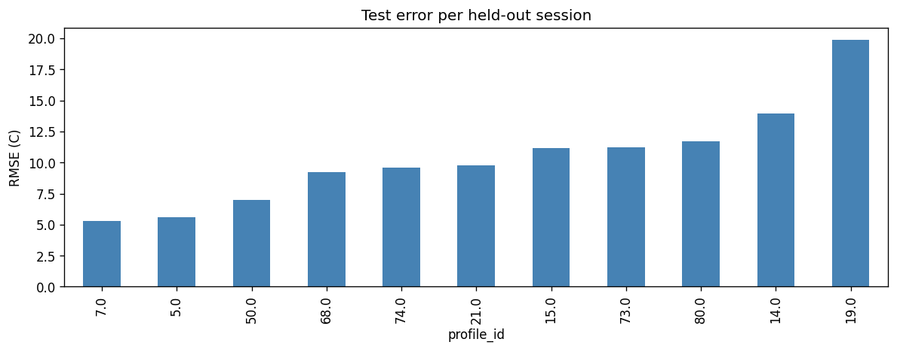
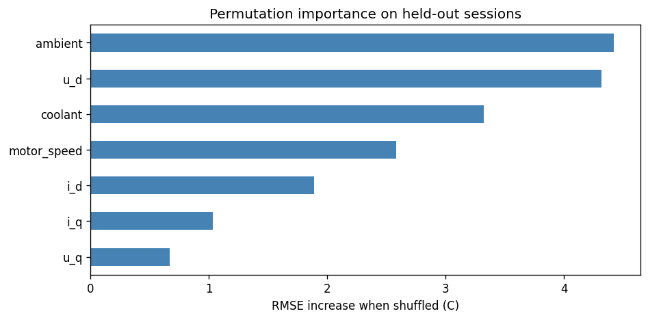

# PMSM Permanent Magnet Temperature Prediction

Regression project to predict the permanent magnet tooth temperature (`pm`) of a
permanent magnet synchronous motor (PMSM) from electrical and thermal sensor
readings recorded across many driving cycles.

**Live demo:** https://pmsm-temperature-prediction-dmtwdmtp9stfq6kyg84vh8.streamlit.app/

## Highlights

- **Test RMSE 10.8 °C, R² 0.67** on motor runs the model never saw, against a
  mean-predictor floor of ~19.6 °C.
- **The validation, not the model, is the hard part.** The data is dense
  time-series sessions; a random split leaks and inflates scores. The split holds
  out whole sessions, and that choice flips the model ranking, a random forest
  that looks perfect on training generalises worse than linear regression.
- **One shared pipeline** drives training, batch scoring, the app and the JSON
  API, so preprocessing can't drift between them; missing values are handled
  in-pipeline.
- Reproducible (pinned deps, fixed seeds), tested (`pytest`), and shipped with a
  trained model and a sample dataset so it runs straight after cloning.

## Problem

The magnet temperature cannot be measured reliably in a deployed motor, but it
drives performance and protection limits. The goal is to estimate `pm` (°C) from
quantities that are measurable in operation: voltage and current components,
motor speed, coolant temperature, and ambient temperature.

## Data

- Source: the `electric_motor_temperature` table of a provided SQLite database
  (`Regression.db`), exported to CSV for this pipeline. The same underlying
  measurements are published publicly as the Kaggle
  [Electric Motor Temperature](https://www.kaggle.com/datasets/wkirgsn/electric-motor-temperature)
  dataset.
- One row per timestep; each `profile_id` is a separate measurement session.
- Target: `pm`. Features: `u_q`, `u_d`, `i_d`, `i_q`, `motor_speed`, `coolant`,
  `ambient`. `profile_id` is a grouping key, not a feature.
- The source table holds ~1.33M records; the extract used here is capped at 2^20
  lines (1,048,575 data rows plus a header), Excel's row limit, so it is a
  truncated slice — ~1.05M rows over 54 sessions.
- About 6.4% of rows have a missing value, in two linked blocks
  (`u_d`+`motor_speed`, and `i_q`+`profile_id`).

The full raw dataset (~100 MB) is not tracked in git. Recreate
`data/raw/electric_motor_temperature.csv` from the source table (or the Kaggle
dataset above) before retraining. A small `data/sample/` extract is included so
the prediction script and app work out of the box, and the trained model is
committed under `models/`, so cloning is
enough to run predictions without the full data or a training run.

## Approach

1. **EDA** (`notebooks/01_eda.ipynb`). Distributions, missingness pattern, and
   the session structure. Within a session the readings are a dense time series
   with near-perfect step-to-step autocorrelation, consecutive rows are almost
   identical.
2. **Preprocessing** (`notebooks/02_preprocessing.ipynb`). Drop rows with no
   `profile_id` (they can't be grouped), then split by holding out whole
   sessions so no session appears in both train and test. Imputation and scaling
   live inside the model pipeline and are fit on training data only.
3. **Baseline** (`notebooks/03_modeling.ipynb`). Linear regression as a
   reference point, reported against a mean predictor.
4. **Model comparison** (`notebooks/04_model_comparison.ipynb`). Ridge, Lasso,
   random forest and histogram gradient boosting under grouped cross-validation,
   with a light grid search on the winner.
5. **Feature engineering check** (`notebooks/05_feature_engineering.ipynb`).
   Physically motivated features (current and voltage magnitudes, electrical
   power) tested. They nudged the single held-out test RMSE down (10.84 to 10.56)
   but did not improve grouped cross-validation, so they were left out rather than
   selected on one holdout.
6. **Evaluation** (`notebooks/06_evaluation.ipynb`). Residual diagnostics and a
   per-session error breakdown.
7. **Interpretation** (`notebooks/07_interpretation.ipynb`). Permutation
   importance on the held-out sessions, cross-checked against linear
   coefficients.

### Why the split is grouped

Because consecutive rows within a session are nearly identical, a random
train/test split would scatter near-duplicate neighbours across both sides and
report a falsely optimistic score. Holding out whole sessions is what makes the
test set a fair measure of performance on a motor run the model has not seen.
The random forest makes this concrete: it fits the training rows almost
perfectly but generalises worse than linear regression to unseen sessions.

## Results

Selected model: tuned histogram gradient boosting
(`learning_rate=0.05`, `max_iter=200`). Metrics on the held-out sessions:

| model                     | test RMSE | test MAE | test R² |
|---------------------------|-----------|----------|---------|
| mean baseline             | 19.57     | 16.93    | -0.07   |
| linear regression         | 11.74     | 9.20     | 0.61    |
| random forest             | 13.21     | 10.36    | 0.51    |
| gradient boosting (tuned) | **10.84** | **8.45** | **0.67**|

These numbers come from the model trained on the 43 training sessions and scored
on the 11 held-out sessions. The committed `models/model.joblib` is the same
pipeline refit on all 54 sessions for deployment, once that split had served its
purpose of giving an honest estimate.

The aggregate hides real variation: per-session RMSE on the held-out runs ranges
from about 5 °C to 20 °C, so the model is accurate on runs that resemble the
training data and weak on operating regimes it hasn't seen. With only 54 sessions
in total, a couple of unusual held-out runs move the headline number a lot. The
test RMSE is best read together with that spread.



### What drives the prediction

Ambient temperature, the d-axis voltage, coolant temperature and motor speed are
the strongest contributors, and the directions are physically sensible: hotter
surroundings, faster operation and a warmer coolant loop go with a hotter magnet.
No single sensor dominates, the estimate is genuinely multivariate.



## Repository layout

```
data/          sample extract (raw and processed are gitignored)
notebooks/     exploration, numbered by stage
src/           reusable modules (data prep, features, model, evaluation)
models/        trained model artifact
reports/       figures
tests/         pipeline smoke tests
train.py       train, report held-out metrics, and save the model
predict.py     load the model and score a batch of records
app.py         streamlit app for single and batch predictions
api.py         flask json endpoint (POST /predict), same pipeline
```

## How to run

```bash
python -m venv .venv
# Windows
.venv\Scripts\activate
# macOS / Linux
source .venv/bin/activate

pip install -r requirements.txt
```

Score the included sample with the committed model (no training needed):

```bash
python predict.py --input data/sample/records.csv --output predictions.csv
```

Or use the interactive app for single and batch predictions (also
[hosted here](https://pmsm-temperature-prediction-dmtwdmtp9stfq6kyg84vh8.streamlit.app/)):

```bash
streamlit run app.py
```

Or serve the model as a JSON endpoint. Both the app and the API score through the
same `predict.predict`, so they return identical results:

```bash
python api.py
curl -X POST http://127.0.0.1:8000/predict -H "Content-Type: application/json" \
  -d '{"u_q":50,"u_d":-10,"i_d":-50,"i_q":30,"motor_speed":2500,"coolant":25,"ambient":24}'
```

The endpoint accepts one record object or a list of them and returns a `pm`
prediction for each.

Retrain from the full dataset (requires the raw CSV in `data/raw/`):

```bash
python train.py
```

Run the tests:

```bash
pytest
```

## Notes

- A fixed random seed is used throughout for reproducibility.
- Imputation and scaling are fit inside the pipeline on training data only, so
  the same steps run identically at training and prediction time.
- The train/test split and cross-validation hold out whole `profile_id`
  sessions to avoid leakage from autocorrelated consecutive measurements.

## License

Released under the MIT License. See `LICENSE`.
